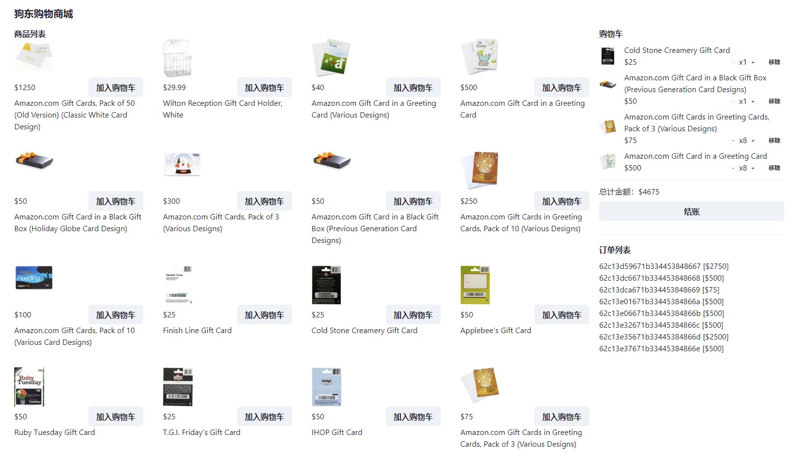
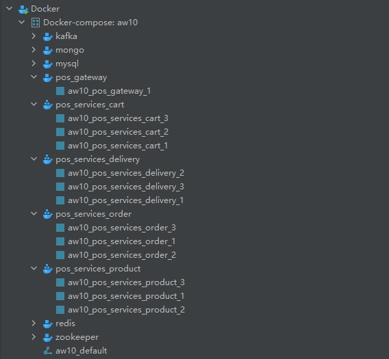

# aw10-final

代码基本从aw09复制过来，添加了docker文件，可以直接容器化启动《狗东购物商城》。

服务器配置：

- 所需的服务：zookeeper作为服务治理，kafka作为消息队列，mysql和mongodb作为数据库，redis作为缓存
- 本地的微服务：网关、商品、购物车、订单、运输服务，可通过docker直接调整数量
    - 微服务采用响应式编程实现
    - 不同微服务之间使用两种方式连接
        - 订单服务等通过REST接口向商品服务获取数据
        - 订单服务通过Kafka消息队列与运输服务传递数据
    - 可通过容器伸缩进行弹性部署

客户端配置：

- React18，可通过CDN直接部署
- 使用Axios与服务器进行交互，使用异步方法更新UI
- 使用Redux对多个组件（例如购物车）共享的状态进行异步管理

启动方法：

1. `docker-compose up -d`（需要在容器内编译Jar包，编译比较慢）
    - 由于mysql启动需要时间，所以商品服务启动太快会无法连接数据库，报错退出，重启商品服务容器即可
2. 进入`pos-client`文件夹，`yarn start`启动客户端

程序压力模拟每个用户查询商品列表、添加商品、删除商品、进行结账的操作。
测试平台：i7 10700k，32G内存，使用Apache JMeter 5.5，测试结果如下：

1. 直接`docker-compose up`启动，每个微服务启动一个实例：
    - 模拟50个用户，每个用户重复操作10次（2500次请求）
        - 平均值 6ms
        - 标准偏差 3.79
        - 错误率 0%
        - 吞吐量 1951.6/s
    - 模拟500个用户，每个用户重复操作10次（25000次请求）
        - 平均值 190ms
        - 标准偏差 112.14
        - 错误率 0%
        - 吞吐量 2383.7/s
    - 模拟1000个用户，每个用户重复操作5次（25000次请求）
        - 平均值 310ms
        - 标准偏差 175.70
        - 错误率 0%
        - 吞吐量 2854.5/s
2. 修改`docker-compose.yml`，关闭网关以外的微服务的端口映射，每个微服务启动三个实例
    - 模拟50个用户，每个用户重复操作10次（2500次请求）
        - 平均值 10ms
        - 标准偏差 5.69
        - 错误率 0%
        - 吞吐量 1738.5/s
    - 模拟500个用户，每个用户重复操作10次（25000次请求）
        - 平均值 182ms
        - 标准偏差 166.10
        - 错误率 0%
        - 吞吐量 2396.2/s
    - 模拟1000个用户，每个用户重复操作5次（25000次请求）
        - 平均值 402ms
        - 标准偏差 277.97
        - 错误率 0%
        - 吞吐量 2154.6/s

微服务内部采用REST接口相互调用，多个用户同时结账时商品服务压力特别大。

微服务开启多个实例并且连续进行测试时电脑风扇猛转，产生超时错误。
让电脑休息一段时间后重新运行测试，性能得到提升并且不再出现错误。~~恐怕是CPU太垃圾了，该换了~~。

最后按照实验要求说明一下满足响应式的几个点：

- Responsive：压力测试反应请求响应时间
- Resilient：Spring框架和Reactor提供错误处理
- Elastic：可通过容器伸缩进行弹性的部署
- Message Driven：不同组件之间使用REST接口和消息队列传递数据

---

> Please develop a **fully functional** online purchase order system.
>
> - It should have a superb collection of goods merchandises
> - Customer can browse/search for merchandises, add selected one into his shopping cart and checkout to complete a transaction.
> - User can get delivery status updates continuously.
>
> The system should be of a **reactive architecture**, which means it should be 
>
> -  Responsive: it should response to the user request timely.
> -  Resilient: it should not be easily broken down.
> -  Elastic: it should be flexible to scale out.
> -  Message Driven: it should has loosely coupled components that communicates with each other asynchronously.
>
>
> Please design tests/experiements to demostrate that your system fulfills such requirements as stated in [The Reactive Manifesto](https://www.reactivemanifesto.org)
>
> **Submit your codes/documents/tests/experiements of your system.**
